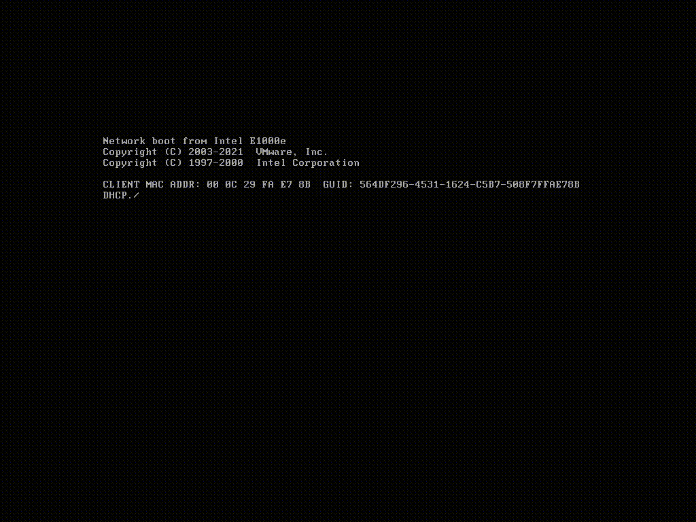

# TFTP-NP - PXE server of dreams!  
## [FAQ](./docs/faq-list.md)



## Что такое TFTP-NP:

**TFTP-NP** - это загрузочный PXE сервер, он позволяет вам запускать операционные системы и полезные программы по сети, используя технологию [PXE](https://ru.wikipedia.org/wiki/PXE). В данном случае используется загрузчик iPXE. Работает на BIOS и UEFI системах, есть только некоторые различия в меню.

После запуска сервера **TFTP-NP** открывается страница приветствия, где вы можете увидеть ссылки на различные компоненты программы.

Вы можете поделиться своими файлами через http-сервер, разместив их в папку `files` в корне сервера. Положив туда любые файлы и папки, и, перейдя по ссылке (для примера [http://localhost:5000/files](http://localhost:5000/files)), вы увидете список своих файлов и папок. Нажав на любом элементе из списка, вы получите ссылку и qr-код для скачивания файла или перейдёте в папку. Так же вы можете размещать там музыку в формате `mp3` и проигрывать её по сети с помощью встроенного плеера.

Настройка меню и добавление новых программ осуществляется путём редактирования файла [menu.ejs](./public/menu.ejs).
 
## Как использовать на Windows:

### 1.

Скачиваете образ iso, распаковываете просто как архив в любую папку, но желательно без пробелов и русских символов.

### 2.

Далее Вам необходимо выбрать режим, к котором будет работать **TFFT-NP**:

* **Вариант 1** - DHCP PROXY MODE:

    Появилась возможность запускать **TFFT-NP** в режиме **DHCP PROXY MODE**. По умолчанию после запуска сервер начинает работать именно в этом варианте и в заголовке программы будет надпись **DHCP PROXY MODE**. Если надпись не появилась, то необходимо  включить этот режим в настройках. Для этого после запуска сервера перейдите по адресу http://localhost:5000/config и установите галочку напротив пункта `dhcp`. Или сделайте это в файле `config.ini` и перезапустите сервер. Обязательно выставьте корректно свой IP адрес и маску подсети, если они неправильно определился автоматически (можно посчитать [тут](https://ip-calculator.ru/)).

* **Вариант 2** - Настройка DHCP сервера:

    1. Если у вас DHCP сервер на Linux, выставляем:

        ```bash
        option space PXE;
        option arch code 93 = unsigned integer 16;
        next-server xxx.xxx.xxx.xxx;
        if option arch = 00:07 {
            filename "boot/efi/bootx64.efi";
        } else {
            filename "boot/bios/undionly.kpxe";
        }
        ```

    2. Если у вас DHCP сервер от Microsoft, пуле ваших IP адресов, в разделе Scope Options добавляем параметры:

       ```bash
       066 Boot Server Host Name "Имя или адрес машины где запущен TFTP-NP, например 192.168.0.2"
       067 Bootfile Name "/boot/efi/bootx64.efi"
       ```

       Более подробно смотрите по [ссылке](https://wtware.ru/win/dhcp2012config.html)
    3. Если у вас DHCP сервер от Mikrotik с версией прошивки `ниже 7.0`, то выставляем только для BIOS или UEFI:
  
        <details>
        <summary>Фото:</summary>
        
        </details>

    4. Если у вас DHCP сервер от Mikrotik с версией прошивки `выше 7.0`, то выставляем разные загрузочные файлы для BIOS и UEFI по [инструкции](./docs/config_mikrotik.md).

### 3.

Запускаете один раз от администратора tftp-np-1.8.3-x64.exe для расшаривания папки с софтом. Если обновляетесь с предыдущих версий, то нужно удалить старую шару, запустить от админа: `net share tftp-np /delete` или запустите от админа `tftp-np\tftp-np\boot\addons\scripts\admin_net_delete_tftp-np.bat`

### 4.

Грузитесь с другой машины по pxe, в настройках биоса укажите загрузку по сети, предварительно отключите `Secureboot`.

### 5.

При выводе запроса `Press secret key to continue...` нажмите сочетание клавиш `CTRL`+`S`

### 6.

Радуетесь)